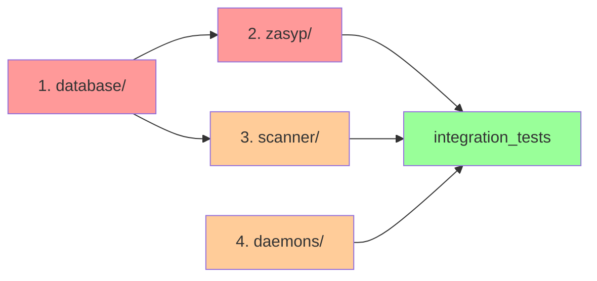

# Plan Refaktoringu — Monolityczne Pliki

## 📊 Podsumowanie

| Plik | Rozmiar | Linii | Priorytet | Status |
|------|---------|-------|----------|--------|
| **database_setup.py** | 73.13 KB | 1282 | 🔴 WYSOKИЙ | ⬜ TODO |
| **zasyp_etapy_service.py** | 61.69 KB | 1338 | 🔴 WYSOKИЙ | ⬜ TODO |
| **scanner_service.py** | 45.15 KB | 886 | 🟡 ŚREDNI | ⬜ TODO |
| **daemon.py** | 41.9 KB | 880 | 🟡 ŚREDNI | ⬜ TODO |

---

## 1️⃣ **database_setup.py** — Inicjalizacja i Migracje BD (73 KB)

### 🎯 Problem
- Wszystkie tabele w jednym pliku (70+ tabele)
- Mieszanie logiki kreacji, inicjalizacji, migracji
- Trudne do testowania i utrzymania
- Brak separacji concerns

### 📋 Plan Podziału

```
app/core/database_setup.py (73 KB)
    ↓
app/core/database/
├── __init__.py
├── tables/
│   ├── __init__.py
│   ├── users_tables.py           (uzytkownicy, pracownicy)
│   ├── agro_tables.py            (agro_stanowiska, plan_produkcji_agro, zasyp_etapy, szarze...)
│   ├── warehouse_tables.py       (magazyn_*, paczki_*)
│   ├── inventory_tables.py       (surowce_*, opakowania_*, dostawa_*)
│   ├── production_tables.py      (plan_produkcji, etapy_produkcji...)
│   ├── system_tables.py          (zgloszenia_bledow, palety, pomiary...)
│   └── quality_tables.py         (non_conformance, triage...)
├── init.py                        (_create_tables() → deleguje do tables/*)
├── fixtures.py                    (_init_admin_user(), _init_agro_stanowiska())
└── validators.py                  (Walidacja schematów tabel)
```

### 📝 Kroki Migracji

**Faza 1**: Utworzenie struktury (bez zmian funkcjonalności)
```bash
1. Utworzenie folderu app/core/database/
2. Przeniesienie kodu do odpowiednich modułów
3. Aktualizacja importów w database_setup.py (facade pattern)
4. Testy integracyjne
```

**Faza 2**: Refaktoryzacja do klasy (opcjonalnie)
```python
class DatabaseManager:
    def __init__(self, db_config):
        self.config = db_config
    
    def create_all_tables(self, cursor):
        UserTables.create_all(cursor)
        AgroTables.create_all(cursor)
        # ...
    
    def init_fixtures(self, cursor):
        # ...
```

### 🔍 Metody do Przeniesienia

| Metoda | Cel |
|--------|-----|
| `_create_tables()` | **tables/__init__.py** — deleguje do submodułów |
| `_init_admin_user()` | **fixtures.py** |
| `_init_agro_stanowiska()` | **fixtures.py** |
| `_init_bufor_zasynpu()` | **fixtures.py** |
| `_ensure_version_tracking()` | **validators.py** |
| `_ensure_column_exists()` | **validators.py** |

---

## 2️⃣ **zasyp_etapy_service.py** — Logika Zasynpu (61 KB, 47 metod)

### 🎯 Problem
- Jedna klasa obsługuje: ładowanie, walidację, timeline, persistencję, UI
- 47 metod w jednej klasie
- Mieszanie logiki domenowej z logiką DB
- Trudne testy dla poszczególnych scenariuszy

### 📋 Plan Podziału

```
app/services/zasyp_etapy_service.py (61 KB, 1 klasa/47 metod)
    ↓
app/services/zasyp/
├── __init__.py
├── models.py                      (EtapRow, ZaszypState — value objects)
├── loaders.py                     (ZasypEtapyLoader — ładowanie z DB)
├── persistence.py                 (ZasypEtapyPersistence — zapis do DB)
├── timeline.py                    (ZasypEtapyTimeline — logika czasów, kolejności)
├── validators.py                  (ZasypEtapyValidator — walidacja reguł biznesowych)
├── use_cases.py                   (ZasypEtapyUseCases — operacje biznesowe)
└── service.py                     (ZasypEtapyService — facade)
```

### 📊 Rozkład Metod (47 → 7 klas)

| Klasa | Metody | Opis |
|-------|--------|------|
| **ZasypEtapyLoader** | 5 | `_load_etapy_rows()`, `_list_szarza_nrs()`, `_resolve_szarza_nr()` |
| **ZasypEtapyTimeline** | 8 | `_build_etapy_payload()`, `_format_duration()`, `_format_hhmm()`, logika czasów |
| **ZasypEtapyPersistence** | 6 | `start_etap()`, `stop_etap()`, `save_pomiary()` — zapis/update |
| **ZasypEtapyValidator** | 5 | `_is_valid_etap_for_linia()`, `_visible_etaps_for_linia()`, walidacje |
| **ZasypEtapyUseCases** | 8 | `kolejny_pomiar()`, `add_dosypka()`, `commit_pomiary()` — scenariusze biznesowe |
| **ZasypEtapySessions** | 4 | `get_etapy_sessions()`, `get_etapy()` — agregacja |
| **ZasypEtapyService** | 5 | Facade — public API |

### 💾 Struktura Danych (models.py)

```python
@dataclass
class EtapRow:
    etap: int
    czas_start: Optional[datetime]
    czas_stop: Optional[datetime]
    start_login: Optional[str]
    stop_login: Optional[str]
    linia: str
    plan_id: int
    szarza_nr: int

@dataclass
class ZaszypState:
    plan_id: int
    linia: str
    szarza_nr: int
    current_etap: int
    etapy: Dict[int, EtapRow]
    timeline: List[Dict[str, Any]]
```

---

## 3️⃣ **scanner_service.py** — Skanowanie i Parsowanie (45 KB, 22 metody)

### 🎯 Problem
- Mieszanie: parsowanie kodów → lookup inventarza → obsługa palet → despacze
- 22 metody w jednej klasie
- Regex patterns rozrzucone po kodzie
- Logika inventory lookup zbyt złożona

### 📋 Plan Podziału

```
app/services/scanner_service.py (45 KB, 1 klasa/22 metod)
    ↓
app/services/scanner/
├── __init__.py
├── parsers.py                     (ScannerParser — normalizacja, regex, SSCC)
├── inventory.py                   (ScannerInventoryLookup — lookup surowce, opakowania)
├── pallet.py                      (ScannerPalletOps — operacje na paletach)
├── dispatch.py                    (ScannerDispatcher — dispatch do produkcji)
└── service.py                     (ScannerService — facade)
```

### 📊 Rozkład Metod (22 → 5 klas)

| Klasa | Metody | Opis |
|-------|--------|------|
| **ScannerParser** | 4 | `_normalize_scanned_code()`, `_is_sscc_code()`, `_extract_prefixed_id()` |
| **ScannerInventoryLookup** | 5 | `_lookup_inventory_row()`, `_lookup_finished_goods()`, `lookup_by_location()` |
| **ScannerPalletOps** | 4 | `move_pallet()`, `split_pallet()`, operacje na paletach |
| **ScannerDispatcher** | 3 | `dispatch_to_production()`, `dispatch_transfer()` |
| **ScannerService** | 6 | Facade — public API |

### 🔧 Konfiguracja Parser (parsers.py)

```python
class ScannerPatterns:
    LOCATION = r'(R\d{6})'
    SSCC = r'([A-Z]{3}\d{18,20}|\d{18,20})'
    PREFIXED_ID = r'^(SUR|OPK|DOD|PAL)-?(\d+)$'
    LOCATIONS = {
        'STORAGE': r'R\d{6}',
        'PRODUCTION': r'MS01|MP01|MDM01|...',
        'TRANSIT': r'W_TRANZYCIE_OSIP|...'
    }

class ScannerParser:
    def normalize(self, code: str) -> str:
        # ...
    
    def parse_sscc(self, code: str) -> Optional[str]:
        # ...
    
    def parse_location(self, code: str) -> Optional[str]:
        # ...
```

---

## 4️⃣ **daemon.py** — Demony Systemu (41.9 KB, 880 linii)

### 🎯 Problem
- Dwa demony w jednym pliku: czyszczenie raportów + monitor palet
- Mieszanie logiki wątków, harmonogramów, obsługi błędów

### 📋 Plan Podziału

```
app/core/daemon.py (41.9 KB)
    ↓
app/core/daemons/
├── __init__.py
├── cleanup_daemon.py              (CleanupDaemon — czyszczenie starych raporty)
├── pallet_monitor_daemon.py       (PalletMonitorDaemon — monitorowanie palet)
├── base.py                        (BaseDaemon — wspólna logika wątków)
└── scheduler.py                   (DaemonScheduler — uruchamianie w app.py)
```

### 🔄 BaseDaemon (wzorzec Template Method)

```python
class BaseDaemon(threading.Thread):
    def __init__(self, interval_seconds: int, name: str):
        self.interval = interval_seconds
        self.name = name
        self.stop_event = threading.Event()
    
    def run(self):
        while not self.stop_event.is_set():
            try:
                self.execute()
            except Exception as e:
                self.handle_error(e)
            self.stop_event.wait(self.interval)
    
    def execute(self):
        raise NotImplementedError()
    
    def handle_error(self, e: Exception):
        raise NotImplementedError()
```

---

## 🔗 Współzależności i Kolejność



### Sugerowana Sekwencja:
1. ✅ **database/** — baza dla wszystkiego
2. ✅ **zasyp/** — logika domenowa (niezależna)
3. ✅ **scanner/** — logika domenowa (niezależna)
4. ✅ **daemons/** — logika systemowa
5. ✅ Integracja i testy

---

## 📋 Checklist Implementacji

### database_setup.py

- [ ] Utworzyć `app/core/database/` folder
- [ ] Przenieść tabele do `tables/users_tables.py`
- [ ] Przenieść tabele do `tables/agro_tables.py`
- [ ] Przenieść tabele do `tables/warehouse_tables.py`
- [ ] Przenieść tabele do `tables/inventory_tables.py`
- [ ] Przenieść tabele do `tables/production_tables.py`
- [ ] Przenieść tabele do `tables/system_tables.py`
- [ ] Przenieść tabele do `tables/quality_tables.py`
- [ ] Przenieść `_init_admin_user()` do `fixtures.py`
- [ ] Przenieść `_init_agro_stanowiska()` do `fixtures.py`
- [ ] Przenieść validatory do `validators.py`
- [ ] Aktualizować `database_setup.py` jako facade
- [ ] Testy jednostkowe dla każdej klasy tabel
- [ ] Testy integracyjne inicjalizacji

### zasyp_etapy_service.py

- [ ] Utworzyć `app/services/zasyp/` folder
- [ ] Przenieść modele do `models.py`
- [ ] Przenieść loader do `loaders.py`
- [ ] Przenieść persistence do `persistence.py`
- [ ] Przenieść timeline do `timeline.py`
- [ ] Przenieść validators do `validators.py`
- [ ] Przenieść use cases do `use_cases.py`
- [ ] Przenieść sessions do `sessions.py`
- [ ] Aktualizować `service.py` jako facade
- [ ] Testy jednostkowe dla każdego komponentu
- [ ] Testy integracyjne end-to-end

### scanner_service.py

- [ ] Utworzyć `app/services/scanner/` folder
- [ ] Przenieść parsery do `parsers.py`
- [ ] Przenieść inventory lookup do `inventory.py`
- [ ] Przenieść operacje na paletach do `pallet.py`
- [ ] Przenieść dispatcher do `dispatch.py`
- [ ] Aktualizować `service.py` jako facade
- [ ] Testy jednostkowe dla każdego komponentu
- [ ] Testy integracyjne end-to-end

### daemon.py

- [ ] Utworzyć `app/core/daemons/` folder
- [ ] Utworzyć `base.py` z BaseDaemon
- [ ] Przenieść czyszczenie do `cleanup_daemon.py`
- [ ] Przenieść monitor do `pallet_monitor_daemon.py`
- [ ] Utworzyć `scheduler.py`
- [ ] Aktualizować `daemon.py` jako facade
- [ ] Testy jednostkowe dla każdego demona

---

## 🚀 Szacunkowy Czas

| Komponent | Analiza | Refactor | Testy | Razem |
|-----------|---------|----------|-------|-------|
| database_setup | 2h | 3h | 2h | **7h** |
| zasyp_etapy_service | 3h | 4h | 3h | **10h** |
| scanner_service | 2h | 3h | 2h | **7h** |
| daemon.py | 1.5h | 2h | 1.5h | **5h** |
| **RAZEM** | **8.5h** | **12h** | **8.5h** | **29h** |

---

## ✅ Kryteria Sukcesu

1. ✅ Każda klasa ma <300 linii kodu
2. ✅ Każda metoda ma <30 linii kodu
3. ✅ Klasy mają jedno zadanie (SRP)
4. ✅ Testy jednostkowe > 80% coverage
5. ✅ Bez zmian API publicznego (backward compatible)
6. ✅ Dokumentacja kodu (docstrings, type hints)
7. ✅ Wymienione importy

---

## 📚 Przydatne Zasoby

- [PEP 226 — Single Responsibility Principle](https://www.python.org/dev/peps/pep-0226/)
- [Facade Pattern](https://refactoring.guru/design-patterns/facade)
- [Repository Pattern](https://martinfowler.com/eaaCatalog/repository.html)
- [Template Method Pattern](https://refactoring.guru/design-patterns/template-method)
